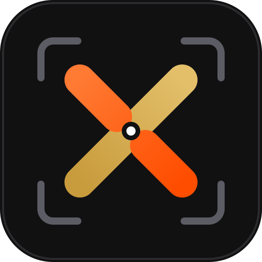
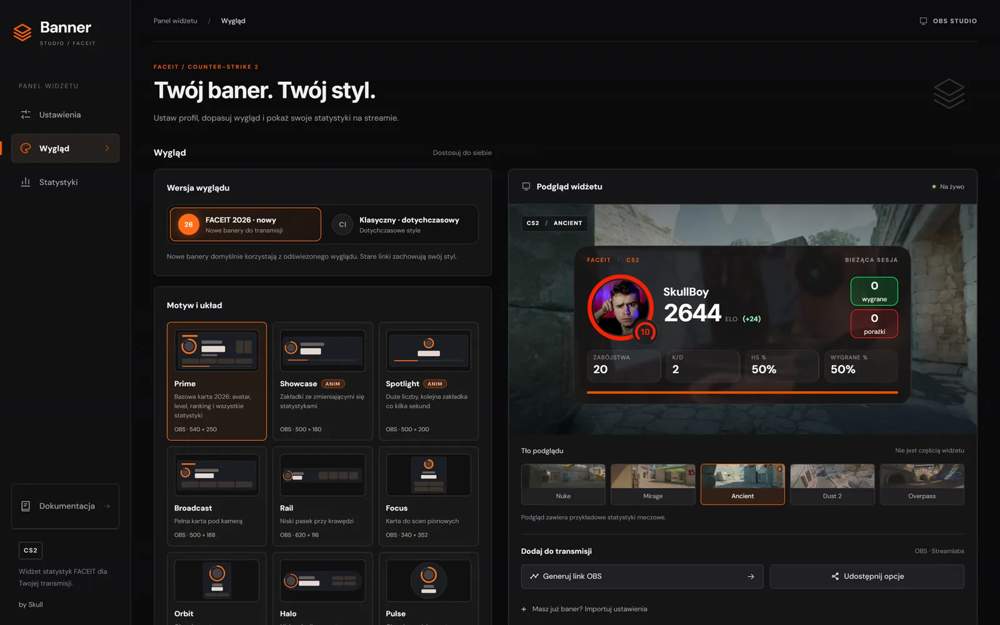
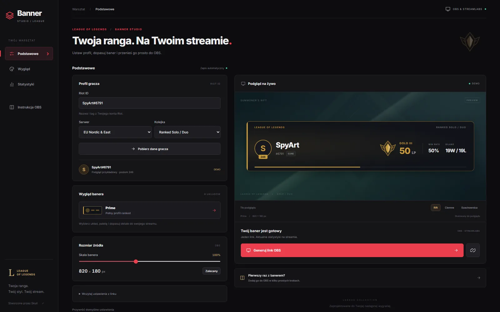

<div align="center">



# VXH – Visual eXtras Hub

**Banery i overlaye do OBS dla streamerów.** Darmowe generatory banera FACEIT (ELO, level, statystyki CS2) i banera rangi League of Legends dla OBS Studio i Streamlabs.

[](https://vxh.pl/)
[](https://faceitbanner.vxh.pl/)
[](https://lolbanner.vxh.pl/)
[](https://astro.build/)

[Strona](https://vxh.pl/) · [Baner FACEIT do OBS](https://vxh.pl/faceit/) · [Baner rangi LoL do OBS](https://vxh.pl/lol/) · [Jak dodać baner do OBS](https://vxh.pl/obs/jak-dodac-baner-do-obs/) · [English](https://vxh.pl/en/)

</div>

---

## Co to jest

**VXH (Visual eXtras Hub)** to hub na domenie [vxh.pl](https://vxh.pl/): statyczna witryna z opisami, poradnikami i FAQ dla dwóch narzędzi dla streamerów. Same generatory działają na osobnych subdomenach. Wpisujesz nick, wybierasz wygląd, kopiujesz link i wklejasz go w OBS albo Streamlabs jako źródło **Browser**. Bez konta, bez wtyczek, za darmo.

| Narzędzie | Do czego | Adres |
|---|---|---|
| **FACEIT Banner Studio** | ELO, level, zmiana ELO i statystyki CS2 na streamie. 18 układów solo, 13 układów VERSUS | [faceitbanner.vxh.pl](https://faceitbanner.vxh.pl/) |
| **LoL Banner Studio** | Ranga Solo/Duo i Flex, LP, winrate i profil z Riot ID. 8 układów | [lolbanner.vxh.pl](https://lolbanner.vxh.pl/) |





## Zawartość serwisu

- Strony narzędzi: baner FACEIT do OBS i baner rangi LoL do OBS, z galeriami układów.
- Poradniki: dodawanie banera do OBS Studio i Streamlabs, ustawienia Browser Source (rozmiar, FPS, przezroczystość).
- FAQ i strona o projekcie.
- Dwie wersje językowe: polska (domyślna) i angielska pod `/en/`, z `hreflang`.

## SEO i indeksowanie

- Jeden szablon generuje wszystkie strony, a treść (PL/EN) siedzi w `src/content.ts`.
- Na każdej stronie: `canonical`, `hreflang`, Open Graph, Twitter Card.
- Dane strukturalne JSON-LD: `Organization`, `WebSite`, `BreadcrumbList`, `WebApplication`, `FAQPage`, `HowTo`.
- Sitemapa (`sitemap-index.xml`), `robots.txt` i `llms.txt` dla wyszukiwarek i modeli AI.
- Statyczny HTML z minimalnym JavaScriptem, obrazy w WebP.

## Stack

[Astro](https://astro.build/) (statyczny build), TypeScript, czysty CSS, `sharp` do obrazów. Wdrożenie przez Docker i nginx (CapRover).

## Uruchomienie lokalne

Wymagania: Node.js 22+ i pnpm.

```bash
pnpm install
pnpm dev        # http://localhost:4321
pnpm build      # statyczna witryna w dist/
pnpm preview    # podgląd builda
```

## Struktura projektu

```text
src/content.ts                 treść PL/EN, ścieżki URL, adresy narzędzi
src/pages/[...slug].astro      szablon wszystkich stron + JSON-LD
src/layouts/Base.astro         meta, canonical, hreflang, menu
src/styles/global.css          style
public/                        logo, obrazy, robots.txt, llms.txt
assets-src/                    źródłowe zrzuty generatorów
scripts/make-images.mjs        zrzuty -> public/img (WebP) i grafika OG
scripts/make-logo.mjs          public/logo.svg -> PNG
deploy/nginx.conf, Dockerfile  wdrożenie
```

Dodanie strony: wpis w `PAGES` i `PATHS` w `src/content.ts`. Sitemapa i `hreflang` uzupełnią się same.

## Wdrożenie (CapRover)

`captain-definition` i `Dockerfile` budują witrynę i serwują ją przez nginx na porcie 80. Ustaw domenę `vxh.pl` i włącz HTTPS. Do działania huba nie potrzeba żadnych zmiennych środowiskowych ani kluczy.

## English

**VXH (Visual eXtras Hub)** is the hub for free OBS overlay and banner generators: a **FACEIT banner** (ELO, level and CS2 stats) and a **League of Legends rank banner** for OBS Studio and Streamlabs. This repository is the static, bilingual (PL/EN) SEO site at [vxh.pl](https://vxh.pl/) built with Astro. The generators live on [faceitbanner.vxh.pl](https://faceitbanner.vxh.pl/) and [lolbanner.vxh.pl](https://lolbanner.vxh.pl/).

## Zastrzeżenia

Niezależny projekt społeczności. Nie jest powiązany z FACEIT ani z Riot Games i nie jest przez nie wspierany. FACEIT jest znakiem towarowym FACEIT Ltd. League of Legends jest znakiem towarowym Riot Games, Inc.

**Słowa kluczowe:** baner faceit do obs, faceit elo overlay, cs2 stats widget, baner rangi lol, league of legends rank overlay, obs overlay, streamlabs overlay, generator banerów dla streamerów.
